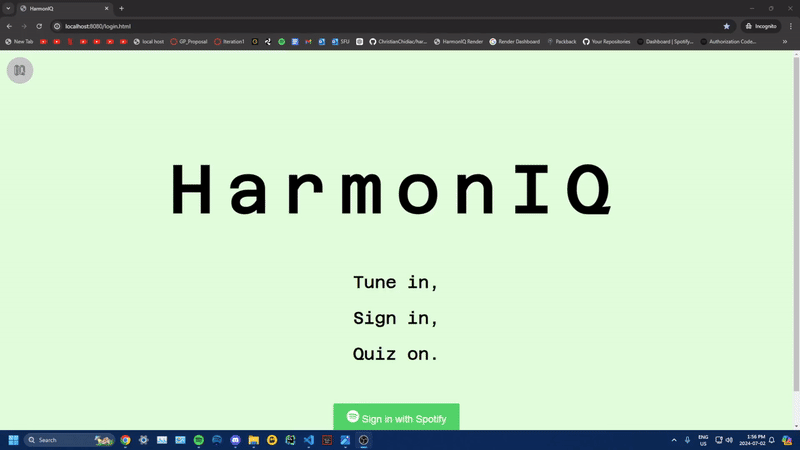
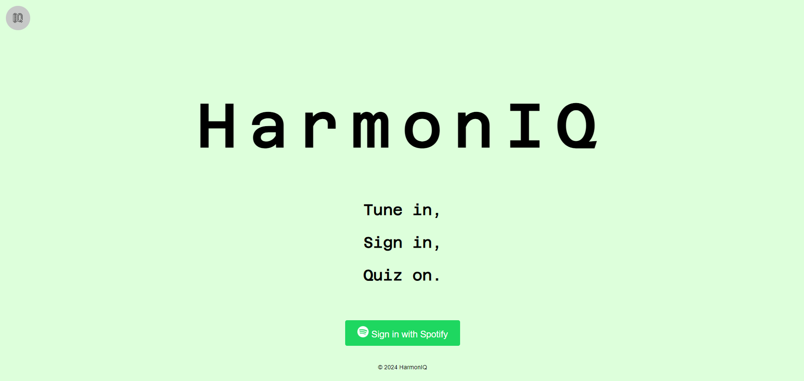
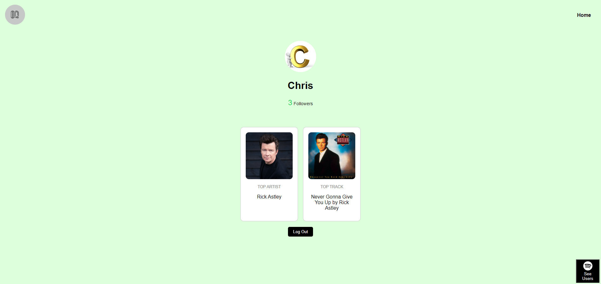
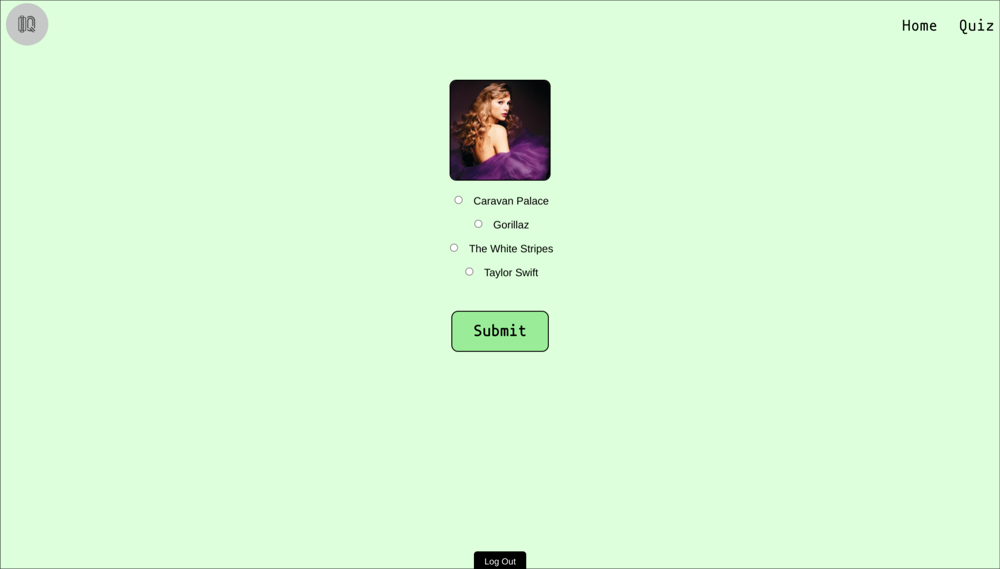
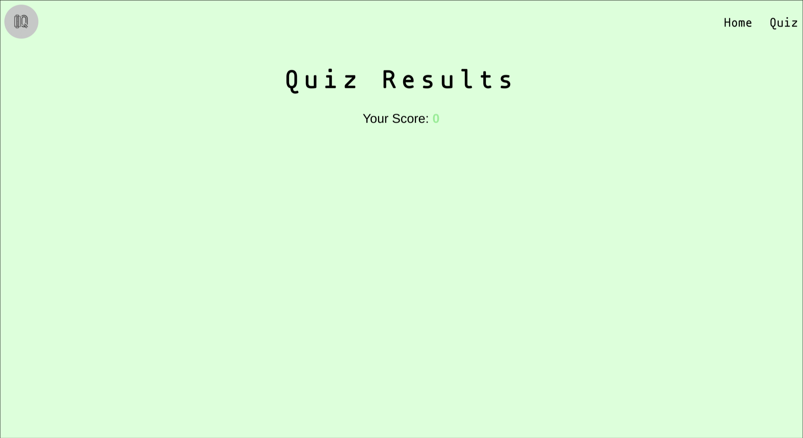

# <u>harmonIQ - Design Document</u>

_Iteration: 1_

# Links and Credentials:

**Website Link**:
- https://harmoniq.onrender.com/
**Gitlink:**
- https://github.com/ChristianChidiac/harmonIQ.git

# Description:

## What is harmonIQ:

**harmonIQ** is an innovative web application designed to provide music enthusiasts with entertainment. Users can log in with their Spotify account to access personalized quizzes based on their listening history, tracks, and library. Additionally, users can view how their quiz scores rank compared to others on a global leaderboard. On top of this, harmonIQ users can generate playlists via a communal voting system, allowing them to share their music passion with friends and family. With features like displaying user statistics, collaborative playlist creation, and generating quizzes personalized to the user, harmonIQ caters to anyone passionate about music, offering a unique platform to enjoy and celebrate their love for music.

## Why use harmonIQ:
Websites such as Whisperify and StatsForSpotify utilize the Spotify web API to generate quizzes and display user listening history, but neither of these sites has the ability to add songs to shared playlists. Spotify does offer a feature to create shared playlists, but it does not allow users to vote on the songs they want to add to the playlists. By combining these features, harmonIQ adds extra functionality compared to other websites and combines their functionality into a singular web application.

## Who is harmonIQ for:
The target audience for our web app is anyone passionate about music. harmonIQ is intended to allow people who love music to enjoy and share their passion with each other, as well as engage in quizzes uniquely tied to their own music taste.

# Requirements and Specifications:

## User Requirements:

- User must have a Spotify account that is whitelisted on the harmonIQ developer dashboard. This limitation holds until harmonIQ gets approved by Spotify to have unlimited user access. Spotify Login Credentials found under [Links and Credentials](https://github.com/ChristianChidiac/harmonIQ/tree/user-table-iteration-2#links-and-credentials) can be used as a temporary workaround to this issue.
- User must be on a desktop browser, and have internet access.

## Functionality Progress:

- [x] User is able to login using the Spotify's OAuth.
- [x] User is redirected to their harmonIQ profile after succesful login. 
- [ ] Users not whitelisted on Spotify Developer Dashboard can login.
- [x] User is able to play a quiz where they match album artwork to their titles.
- [x] User is able to see some information related to their Spotify account, such as top tracks.
- [ ] Administrative type user accounts, with special app privileges.
	- Demo of Admin page and user list: 

- [x] User is able to logout of their account and is redirected to login landing page.

# Examples:

## User Stories:

User stories are simple descriptions of a feature or functionality from a harmonIQ user's perspective. They outline examples of harmonIQ user cases and the steps needed to achieve them.

To explore a list of harmonIQ user stories, please visit our [User Story Page](https://github.com/ChristianChidiac/harmonIQ/wiki/User-Stories).

## Page Examples

**Login Page:**

**Profile Page:**

**Quiz Page:**

# Test Cases:

Test cases are detailed scenarios that outline how specific features or functionalities of harmonIQ should behave under different conditions. These cases help our team validate that harmonIQ functions reliably and meets user expectations. 

To explore detailed test cases for harmonIQ, visit our [Test Case Page](https://github.com/ChristianChidiac/harmonIQ/wiki/Test-Cases).

#
_If you have any questions or need further assistance, feel free to ask!_
